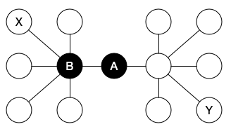

---
jupyter:
  jupytext:
    text_representation:
      extension: .Rmd
      format_name: rmarkdown
      format_version: '1.2'
      jupytext_version: 1.18.1
  kernelspec:
    display_name: R
    language: R
    name: ir
---

```{r}
library(igraph)
```

## Load network data

In this case the data file is in edgelist format. The network could be also read as [adjacency matrix](https://igraph.org/r/doc/graph_from_adjacency_matrix.html) or [data frame](https://igraph.org/r/doc/graph_from_data_frame.html) which allows also putting in metadata which describes nodes.

```{r}
data <- read.csv('data/network_simple.csv')
data <- as.matrix( data )
network <- graph_from_edgelist( data, directed = FALSE )
```

Guess what these two measurements could be?

```{r}
ecount( network )
vcount( network )
```

## Degree

In networks, degree measures the number of ties each connection has.

- Exercise: compare how degree changes if the network is directed or non-directed. Why?
- Exercise: Check the [documentation](https://igraph.org/r/doc/degree.html) to calculate only _in_-degree and _out_-degree.

```{r}
degree( network )
summary( degree( network ) )
hist( degree( network ) )
```

## Centrality measurements



* What kind of phenomena might have a network like this? Give three examples.
* What is the degree of node `A` and what is the degree of node `B`?
* What happens in the network if node `A` is removed?

As the example illustrates, degree alone does not fully account which roles nodes have in the network.
Therefore, network analysis has established various other tools to describe nodes in the network, such as

* [betweeness](https://igraph.org/r/doc/betweenness.html)
* [closeness](https://igraph.org/r/doc/closeness.html)
* [eigen_centrality](https://igraph.org/r/doc/eigen_centrality.html)
* [hub_score](https://igraph.org/r/doc/hub_score.html)
* [authority_score](https://igraph.org/r/doc/authority_score.html)

Try out these and explore how different scores give different idea of nodes in the network.

Note how we can assing each node (vertex) or tie (edge) values using R-notation: `V( network_object )$attribute_name <-` or similary with `E( network_object )`

```{r}
V(network)$betweeness <- betweenness( network ) ## storing betweeness as a vertex attribute
summary( V(network)$betweeness )
hist( V(network)$betweeness )
```

```{r}
V(network)[1:4]$betweeness ## only nodes 1-4 and their betweeness
```

## Beyond node-level analysis

Above examples have focused on understanding measurements at the node level.
However, networks can also be studies as a whole. These include

* [edge_density](https://igraph.org/r/doc/edge_density.html)
* [diameter](https://igraph.org/r/doc/diameter.html)
* [mean_distance](https://igraph.org/r/doc/distances.html)
* [transitivity](https://igraph.org/r/doc/transitivity.html)

```{r}
edge_density( network )
```

## Final thinking

Where could you use these different measurements?

```{r}

```
